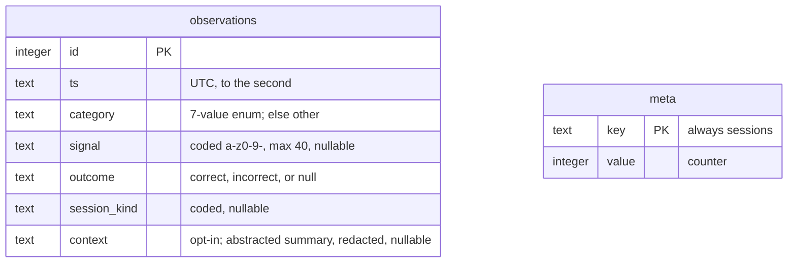
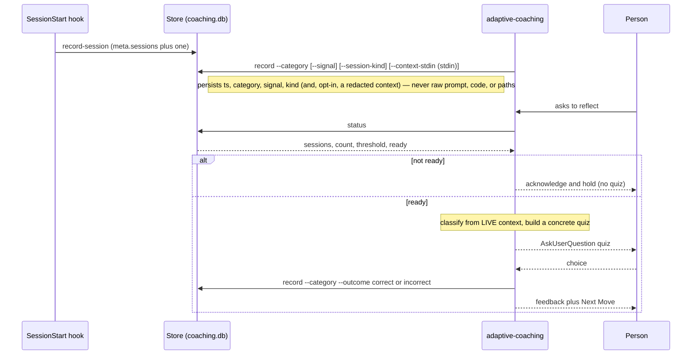

# Hooks

## SessionStart injection

`hooks/hooks.json` registers one `SessionStart` hook (matching `startup`, `clear`,
and `compact`). It runs `hooks/session-start.sh`, which:

1. Reads `skills/using-clairvoyance/SKILL.md` and injects it as
   `additionalContext` so the agent has the bootstrap router from the first turn.
2. Resolves the active contributor's language and injects it as authoritative for
   Clairvoyance handoffs in this session.
3. Counts this session toward the adaptive-coaching grace period
   (`record-session`). The hook pushes **no** coaching: the reflection quiz fires
   only when the human asks to reflect (handled by `adaptive-coaching` reading the
   store), never from this hook. The session count advances on every SessionStart
   (startup, clear, and compact), and the hook reads no stdin so it never blocks.

If the bootstrap skill file is missing, the hook exits 0 and injects nothing.

## Adaptive-coaching store

`hooks/adaptive-store.sh` is the store entry point: a CLI that persists a
small, **anonymous** record of adaptive-challenge observations on the operator's own
workstation, so `adaptive-coaching` waits until enough signal has accumulated before
it coaches. By default it stores only coded metadata — an adaptive-challenge
category, a short coded signal label, a quiz outcome, the session kind, and a UTC
timestamp — never prompt text, code, or file paths. Opt-in context capture (below)
can additionally store an abstracted, secret-redacted scenario summary.

- **Subcommands.** `record --category <c> [--signal …] [--outcome correct|incorrect]
  [--session-kind …] [--context-stdin]` appends one observation (with
  `--context-stdin` the context is read from stdin, never argv, and is stored only
  with context capture on); `record-session` counts one chat session; `status`
  reports the counts and whether it is `ready`. Each prints one JSON object and
  (apart from a missing required `--category`) always exits 0.
- **Two-gate readiness.** A reflection quiz is delivered only when the human asks
  AND `ready` is true, so a first-time user with thin data is never quizzed:
  `ready` needs **both** a **session grace period**
  (`$CLAIRVOYANCE_SESSION_THRESHOLD`, default 50 sessions; 0 disables it) **and**
  **accumulated adaptive signal** (`$CLAIRVOYANCE_COACH_THRESHOLD`, default 5
  observations).
- **Location** (first match wins): `$CLAIRVOYANCE_DATA_DIR`, else
  `%LOCALAPPDATA%\clairvoyance` (the Windows workstation default), else
  `$XDG_DATA_HOME/clairvoyance`, else `~/.clairvoyance`; the file is `coaching.db`.
- **Volatility is tolerated.** Ephemeral or read-only environments (remote sessions,
  sandboxes) simply do not persist, and any storage error degrades to
  "not available / not ready" rather than failing the session.
- **Context capture and rotation.** `CLAIRVOYANCE_STORE_CONTEXT=1` (default off)
  stores an abstracted, secret-redacted summary (read from stdin via
  `--context-stdin`) so a later reflection can reproduce the moment. Rotation keeps
  the store bounded:
  `CLAIRVOYANCE_MAX_OBSERVATIONS` (default 500, newest kept) and
  `CLAIRVOYANCE_MAX_AGE_DAYS` (default 180); `0` disables either bound.

### Backend (SQLite CLI, no Python)

The store is backed by the `sqlite3` CLI — install with `choco install sqlite` on
Windows (Git for Windows bundles no `sqlite3`); on macOS/Linux it is usually
present. There is **no Python fallback**: if the CLI is absent the store degrades
to "not available" and coaching simply stays inactive (the session is unaffected).
`session-start.sh` detects readiness from the store's JSON with a shell glob, so
the readiness cue needs no runtime of its own.

`scripts/check_hooks.sh` syntax-checks `adaptive-store.sh` (`bash -n`, no side
effects); `tests/test_adaptive_store.py` exercises its behaviour.

### Data model and lifecycle

**What "anonymous" means, and reproduction.** The store holds content-scrubbed
coded metadata on the person's own machine; it is not transmitted or aggregated.
By default it answers *whether* to coach (recurring signal of a kind, fairly
gated), not *what happened* — the concrete scenario is rebuilt from the live
session. With context capture enabled (opt-in), an abstracted, secret-redacted
summary is retained, so a later reflection can reproduce the moment from the store;
this trades some privacy for fidelity and stays local-only.

### Known limitations (cross-cutting gaps)

Deliberate trade-offs and known gaps in the record → trigger → quiz → outcome
procedure, so operators can judge the privacy/utility balance:

1. **No scenario is persisted by default.** Reproduction then depends on the
   pattern being live in the reflection session. Enabling context capture (opt-in)
   retains an abstracted, redacted summary that bridges sessions; left off, only
   the category counter does.
2. **`signal` is optional and un-vocabularised**, so distinct patterns in one
   category collapse together; the lever that could keep them apart (anonymously)
   goes unused.
3. **Outcome rows are not linked to the observation they score** and also count
   toward `count`, so the readiness gate conflates observations with quiz
   scorings, and "is this habit fading?" is only a category-level trend.
4. **The sanitiser enforces charset and length, not semantic anonymity** — a
   careless `signal` can still encode identifying specifics.
5. **Volatility vs. where work happens.** Remote or ephemeral sessions do not
   persist, so observations made there are lost and the recurring signal can
   undercount.
6. **Coarse decay.** Rotation bounds the store by count and age
   (`CLAIRVOYANCE_MAX_OBSERVATIONS` / `CLAIRVOYANCE_MAX_AGE_DAYS`), so a long-faded
   habit ages out; within the window, readiness is still a raw count with no finer
   recency weighting.
7. **Taxonomy mismatch.** The references' Type I/II/III and `technical-not-understood`
   have no matching store category, so the latter folds to `other`.

### Codex

Codex reads its own `SessionStart` manifest, `hooks/codex-hooks.json`
(pointed at by `.codex-plugin/plugin.json`). It matches the same events
(plus Codex's `resume`) and drives the **same** `session-start.sh` through the
**same** `run-hook.cmd` wrapper. The only difference is the plugin-root variable:
Claude Code substitutes `${CLAUDE_PLUGIN_ROOT}` and Codex substitutes
`${PLUGIN_ROOT}`. Keeping a separate manifest per runtime avoids that variable
clash in a single shared file while reusing one hook implementation.

### Contributor language

Operator-facing handoffs are written in the **active contributor's** native
language — the person driving the current session, not a fixed repository owner.
This is what keeps a multi-contributor project from forcing one person's language
on everyone: the language is resolved per-contributor, keyed by the session's git
identity.

The per-contributor mapping lives in a **committed** file,
`<project>/.clairvoyance/contributor-languages.txt`, with one
`identity = language` line per contributor (keyed by git email, then git name;
`#` comments and blank lines ignored, keys matched case-insensitively). Because
the file is committed, use a **non-harvestable** key — a git name or a GitHub
`users.noreply.github.com` address — never a personal email, which would become a
public scraping target. It is committed on purpose, for two reasons:

- It is the repository's **signal** of which native languages its contributors
  use — useful information, not something to hide in `.gitignore`.
- It is the only per-contributor source that **survives a volatile/ephemeral
  checkout** (Claude web, CI), where local-only state is wiped on every run. A
  git-ignored per-contributor file would simply vanish there.

The language is resolved in this order (first match wins). A contributor listed
in the committed mapping always gets their own language — only an explicit
per-session override can outrank it — so the owner's language is never served to a
different contributor:

1. `CLAIRVOYANCE_OPERATOR_LANGUAGE` environment variable — an explicit per-session
   override, set in the contributor's own environment; also survives a volatile
   environment via its environment config.
2. The committed mapping, looked up by this session's git `user.email`, then
   `user.name`.

If neither resolves, the language is treated as **not recorded** and the hook
drives the portable question handoff (below). No legacy owner source is consulted
as a value.

The legacy `CLAIRVOYANCE_OWNER_LANGUAGE` environment variable and a legacy
single-value `<project>/.clairvoyance/owner-language.txt` are **not** used as
value sources. Each holds one person's (the owner's) language, so serving it to
any other contributor is exactly the owner-fixation this design removes — the very
bug where every contributor was handed the owner's language, and it would silently
shadow the "if missing, ask" contract. When either is present it is surfaced only
as a one-time **migration hint** in the unrecorded path: move its value into the
committed mapping under the owner's own identity (or have each contributor set
`CLAIRVOYANCE_OPERATOR_LANGUAGE`, which already covers the legitimate explicit
per-session override), then delete the legacy source.

If nothing matches, the injected context instructs the agent **not** to default to
any owner's or other person's language, and to ask the human in the session once
(via `AskUserQuestion`) for **their own** native language, then record it — add an
`identity = language` line to the committed mapping (so the signal persists across
volatile checkouts), or set `CLAIRVOYANCE_OPERATOR_LANGUAGE` for the session.

> **Note — upstream `AGENTS.md` framing.** `AGENTS.md` is synced read-only from
> the upstream and still phrases the rule as "the primary project owner's native
> language". Per its own clause, a SessionStart language injection is authoritative
> and overrides that default, so once this hook injects a contributor's language
> the wording no longer bites. The gap is the unrecorded case: with no injected
> language, an agent following `AGENTS.md` could still reach for the *owner's*
> language — which is why the unrecorded-path injection explicitly forbids that and
> asks the contributor instead. Fully retiring the "owner" wording requires an
> upstream change in `tvna/claude-md`.

## Cross-platform entry point

`hooks.json` invokes `hooks/run-hook.cmd session-start.sh`. `run-hook.cmd` is a
**polyglot** that runs as both a Windows batch file and a POSIX shell script, so a
single entry point works on every platform:

- **Windows** (`cmd.exe` runs the batch block): locates a Bash interpreter by
  checking, in order, system Git for Windows (`C:\Program Files\Git`,
  `C:\Program Files (x86)\Git`), per-user Git
  (`%LOCALAPPDATA%\Programs\Git`), then any `bash` on `PATH`. If none is found it
  exits 0 — the session starts normally without injection rather than erroring.
- **macOS / Linux**: the file is executable but has no shebang, so the shell falls
  back to interpreting it; the batch block is a no-op heredoc and the script
  `exec`s `bash` on the target hook.

`run-hook.cmd` must keep its executable bit (`100755`) for the Unix fall-through to
work. CI validates both hook scripts with `bash -n`, asserts that
`session-start.sh` emits valid JSON, and parses `codex-hooks.json` to confirm it
routes through the same wrapper with the `${PLUGIN_ROOT}` variable.
