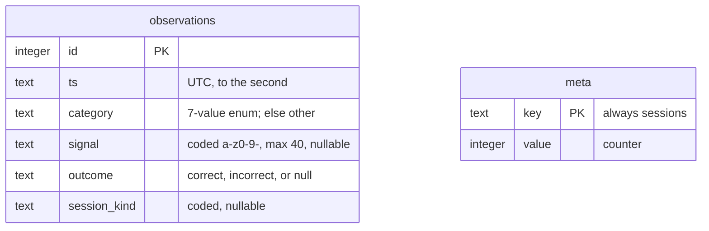
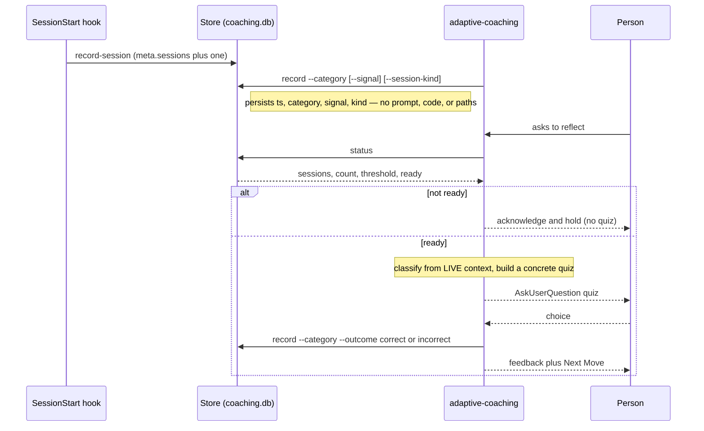

# Hooks

## SessionStart injection

`plugin/hooks/hooks.json` registers one `SessionStart` hook (matching `startup`, `clear`,
and `compact`). It runs `plugin/hooks/session-start.sh`, which:

1. Reads `plugin/skills/using-clairvoyance/SKILL.md` and injects it as
   `additionalContext` so the agent has the bootstrap router from the first turn.
2. Resolves the project owner's language and injects it as authoritative for
   Clairvoyance handoffs.
3. Counts this session toward the adaptive-coaching grace period
   (`record-session`). The hook pushes **no** coaching: the reflection quiz fires
   only when the human asks to reflect (handled by `adaptive-coaching` reading the
   store), never from this hook. The session count advances on every SessionStart
   (startup, clear, and compact), and the hook reads no stdin so it never blocks.

If the bootstrap skill file is missing, the hook exits 0 and injects nothing.

## Adaptive-coaching store

`plugin/hooks/adaptive-store.sh` is the store entry point: a CLI that persists a
small, **anonymous** record of adaptive-challenge observations on the operator's own
workstation, so `adaptive-coaching` waits until enough signal has accumulated before
it coaches. It stores only coded metadata — an adaptive-challenge category, a short
coded signal label, a quiz outcome, the session kind, and a UTC timestamp — never
prompt text, code, or file paths.

- **Subcommands.** `record --category <c> [--signal …] [--outcome correct|incorrect]
  [--session-kind …]` appends one observation; `record-session` counts one chat
  session; `status` reports the counts and whether it is `ready`. Each prints one
  JSON object and (apart from a missing required `--category`) always exits 0.
- **Two-gate readiness.** A reflection quiz is delivered only when the human asks
  AND `ready` is true, so a first-time user with thin data is never quizzed:
  `ready` needs **both** a **session grace period**
  (`$CLAIRVOYANCE_SESSION_THRESHOLD`, default 50 sessions; 0 disables it) **and**
  **accumulated adaptive signal** (`$CLAIRVOYANCE_COACH_THRESHOLD`, default 5
  observations).
- **Location** (first match wins): `$CLAIRVOYANCE_DATA_DIR`, else
  `%LOCALAPPDATA%\clairvoyance` (the Windows workstation default), else
  `$XDG_DATA_HOME/clairvoyance`, else `~/.clairvoyance`; the file is `coaching.db`.
- **Volatility is tolerated.** Ephemeral or read-only environments (remote sessions,
  sandboxes) simply do not persist, and any storage error degrades to
  "not available / not ready" rather than failing the session.

### Backend (SQLite CLI, no Python)

The store is backed by the `sqlite3` CLI — install with `choco install sqlite` on
Windows (Git for Windows bundles no `sqlite3`); on macOS/Linux it is usually
present. There is **no Python fallback**: if the CLI is absent the store degrades
to "not available" and coaching simply stays inactive (the session is unaffected).
`session-start.sh` detects readiness from the store's JSON with a shell glob, so
the readiness cue needs no runtime of its own.

`scripts/check_hooks.sh` syntax-checks `adaptive-store.sh` (`bash -n`, no side
effects); `tests/test_adaptive_store.py` exercises its behaviour.

### Data model and lifecycle

**What "anonymous" means, and reproduction as a non-goal.** The store holds
content-scrubbed coded metadata on the person's own machine; it is not transmitted
or aggregated. It answers *whether* to coach (recurring signal of a kind, fairly
gated), not *what happened* — the concrete quiz scenario is rebuilt from the live
session, never replayed from the store. Reproducing a past quiz from the store
alone is therefore out of scope by design.

### Known limitations (cross-cutting gaps)

Deliberate trade-offs and known gaps in the record → trigger → quiz → outcome
procedure, so operators can judge the privacy/utility balance:

1. **No scenario is persisted.** Reproduction depends on the pattern being live in
   the reflection session; reflect in a fresh session and the quiz degrades to
   generic. Only the category counter bridges sessions.
2. **`signal` is optional and un-vocabularised**, so distinct patterns in one
   category collapse together; the lever that could keep them apart (anonymously)
   goes unused.
3. **Outcome rows are not linked to the observation they score** and also count
   toward `count`, so the readiness gate conflates observations with quiz
   scorings, and "is this habit fading?" is only a category-level trend.
4. **The sanitiser enforces charset and length, not semantic anonymity** — a
   careless `signal` can still encode identifying specifics.
5. **Volatility vs. where work happens.** Remote or ephemeral sessions do not
   persist, so observations made there are lost and the recurring signal can
   undercount.
6. **No recency or decay.** Readiness is a raw count ≥ threshold; observations of a
   long-faded habit count equally with fresh ones.
7. **Taxonomy mismatch.** The references' Type I/II/III and `technical-not-understood`
   have no matching store category, so the latter folds to `other`.

### Codex

Codex reads its own `SessionStart` manifest, `plugin/hooks/codex-hooks.json`
(pointed at by `plugin/.codex-plugin/plugin.json`). It matches the same events
(plus Codex's `resume`) and drives the **same** `session-start.sh` through the
**same** `run-hook.cmd` wrapper. The only difference is the plugin-root variable:
Claude Code substitutes `${CLAUDE_PLUGIN_ROOT}` and Codex substitutes
`${PLUGIN_ROOT}`. Keeping a separate manifest per runtime avoids that variable
clash in a single shared file while reusing one hook implementation.

### Owner language

The owner's language is resolved in this order:

1. `CLAIRVOYANCE_OWNER_LANGUAGE` environment variable.
2. The first non-blank line of `<project>/.clairvoyance/owner-language.txt`.

If neither is set, the injected context instructs the agent to ask the human once
(via `AskUserQuestion`) and then write `.clairvoyance/owner-language.txt`.

## Cross-platform entry point

`hooks.json` invokes `plugin/hooks/run-hook.cmd session-start.sh`. `run-hook.cmd` is a
**polyglot** that runs as both a Windows batch file and a POSIX shell script, so a
single entry point works on every platform:

- **Windows** (`cmd.exe` runs the batch block): locates a Bash interpreter by
  checking, in order, system Git for Windows (`C:\Program Files\Git`,
  `C:\Program Files (x86)\Git`), per-user Git
  (`%LOCALAPPDATA%\Programs\Git`), then any `bash` on `PATH`. If none is found it
  exits 0 — the session starts normally without injection rather than erroring.
- **macOS / Linux**: the file is executable but has no shebang, so the shell falls
  back to interpreting it; the batch block is a no-op heredoc and the script
  `exec`s `bash` on the target hook.

`run-hook.cmd` must keep its executable bit (`100755`) for the Unix fall-through to
work. CI validates both hook scripts with `bash -n`, asserts that
`session-start.sh` emits valid JSON, and parses `codex-hooks.json` to confirm it
routes through the same wrapper with the `${PLUGIN_ROOT}` variable.
