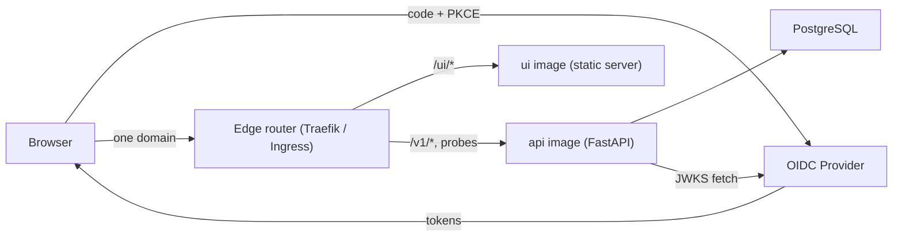
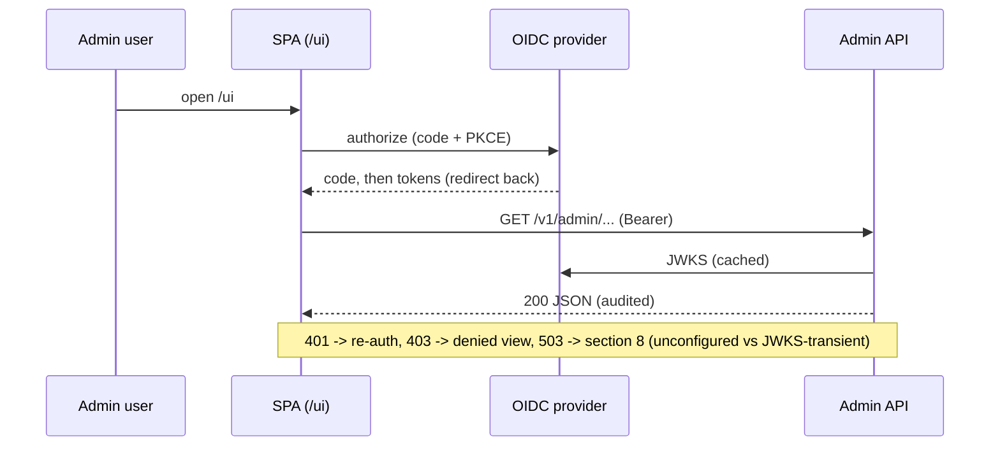
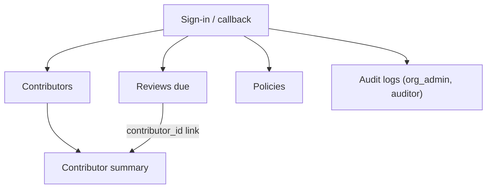

# Admin Frontend Design

Design for the admin UI of the managed coaching server. #51 shipped the
server as a JSON-only API and deferred the UI; this document completes the
design so implementation can start as its own change. Tracking issue: #55.

Status: **design complete, implementation not started.** The server stays
JSON-only until the implementation lands. Every screen below maps to the
admin API that actually shipped (`app/api/admin.py`, `app/schemas/admin.py`);
the design assumes **no backend change**: the UI ships as its own image
and its runtime config is a ui-image concern (section 6).

## 1. Scope and goals

The frontend serves the four admin roles (org_admin, team_manager, coach,
auditor) who today must curl the JSON API. Contributors and local clients
are out of scope: the collector path is machine-to-machine and has no UI.

Goals, in priority order:

1. Make coaching state visible by inspection: who is active, what categories
   dominate, which reviews are due, what the org policy allows.
2. Make the two privileged writes (policy edits) safe: explicit, role-gated,
   with the privacy implications stated where the toggle is.
3. Add zero trust surface: no new credential store, no server-side session,
   no data the JSON API does not already expose.

Non-goals: contributor-facing views, team dashboards (teams are not modeled
yet), historical trend charts (no time-series endpoint exists), and any
write beyond `PUT /v1/admin/policies`.

## 2. Users and role-based access

Roles come from the verified OIDC token (`app/auth/rbac.py`) and the server
is authoritative; the UI reads the same claims only to shape navigation.

| Capability                  | org_admin | team_manager | coach | auditor |
| --------------------------- | --------- | ------------ | ----- | ------- |
| Contributors list + summary | yes       | yes          | yes   | yes     |
| Reviews due                 | yes       | yes          | yes   | yes     |
| Policies: view              | yes       | yes          | yes   | yes     |
| Policies: edit              | yes       | no           | no    | no      |
| Audit logs                  | yes       | no           | no    | yes     |

Hiding a nav item is a courtesy, not a control: a hand-crafted request to a
role-denied route still gets 403 from the server and still lands in the
audit trail (the audit dependency runs before the role gate).

## 3. Architecture decision

Four options were considered. In all SPA options the browser does OIDC
Authorization Code + PKCE and calls the JSON API with a bearer token.

| Option | Description | Trade-offs |
| ------ | ----------- | ---------- |
| A. Single image | Vite-built static bundle served by the existing `api` process at `/ui` (StaticFiles mount, multi-stage build). | No CORS, no new Compose service -- but the release artifact couples UI and server: a CSS tweak rebuilds the server image and redeploys worker/scheduler, and the static mount and any config route compete for paths inside one process. |
| B. Server-rendered (Jinja2/htmx) | FastAPI renders HTML; auth via session cookie after an OIDC code flow handled server-side. | Fewer moving parts in the browser, but introduces server-side sessions, CSRF handling, and a cookie auth path parallel to the bearer path the API already has -- two auth models to audit instead of one. |
| **C. Separate ui image, same origin (chosen)** | The SPA ships as its own static-server image (`managed/ui/Dockerfile`); the edge router (Traefik under Coolify, Ingress on Kubernetes) serves one domain and splits paths: `/ui/*` to the ui container, everything else to the api container. | Independent artifacts and release cadence, zero backend change, still no CORS/no cookies (one origin at the edge). Cost: a second service to run and health-check, and the path split must exist in every environment, including the E2E harness. |
| D. Separate image and domain | Same ui image as C on its own domain. | Adds CORS configuration and a second TLS/domain surface for no additional benefit over C today. |

**Decision: Option C** (owner decision, 2026-07-03: release artifacts must
be separable; supersedes the earlier option-A draft of this document). The
API already speaks OIDC bearer and is provider-agnostic -- the browser is
just another client of it -- and the edge keeps the origin unified so none
of the CORS/cookie machinery of option D is needed. Revisit D only if the
UI must ever leave the shared domain.



## 4. Technology selection

Chosen for the smallest dependency set that keeps the implementation
testable; each line is a decision, alternatives were considered and dropped
as speculative for a five-screen UI.

- **React + TypeScript + Vite.** Boring, dominant, typed against the API
  contract. (Svelte/htmx would also work; React maximizes contributor
  familiarity and testing-library maturity.)
- **TanStack Query** for server state: caching and invalidation after the
  policy write. No Redux or global client state -- the server is the
  state. Library defaults are overridden globally: `retry` fires only on
  network errors, never on resolved 4xx/5xx responses (section 8's table
  owns those; every admin request is audited server-side and the API has
  no rate limiting, so blind retries multiply audit rows), and
  `refetchOnWindowFocus` is off for the same reason.
- **react-router** for the five routes.
- **oidc-client-ts** for Authorization Code + PKCE and silent renewal. This
  is the one dependency doing security work, pinned and reviewed like one.
- **Zod schemas mirroring `app/schemas/admin.py`** at the fetch boundary, so
  a contract drift fails a test instead of rendering `undefined`.
- **Plain CSS (CSS modules), no component framework.** Five screens do not
  earn a design-system dependency; tokens (spacing, palette) live in one
  `tokens.css`.
- **Charts as inline SVG** (a bar list for categories, a segmented bar for
  calibration). No chart library: the two visuals are static aggregates.
- **Biome** for lint + format (one tool, mirrors ruff's role server-side),
  **Vitest + Testing Library** for unit tests, **Playwright** for the E2E
  smoke path (section 13).

Versions are pinned by `package-lock.json` / committed lockfile, matching
the declarative-dependency rule the server side follows with `uv.lock`.

## 5. Authentication and session model

- **Flow:** Authorization Code + PKCE, public client, initiated by the SPA.
  No client secret exists in the browser.
- **Token handling:** access token kept in memory only (never
  localStorage/sessionStorage); silent renewal via refresh-token rotation
  through oidc-client-ts, with the rotated refresh token in the same
  in-memory store as the access token. Iframe silent renew is explicitly
  not used: it depends on third-party cookies browsers are removing, and
  section 9's CSP (`default-src 'self'`, no `frame-src`) blocks issuer
  iframes by design. On a provider without refresh-token rotation for
  public clients, expiry falls back to a full redirect. A hard reload
  re-runs the redirect flow; that is acceptable for an admin tool and
  cheaper than a persisted-token attack surface.
  - Memory-only is **not** the library default and must be configured
    explicitly: oidc-client-ts defaults `userStore` to
    `window.sessionStorage` (verified in `UserManagerSettings.ts`), so the
    implementation must set
    `userStore: new WebStorageStateStore({ store: new InMemoryWebStorage() })`
    and a test must pin that no token ever lands in web storage.
  - The redirect interaction state (`stateStore`: state, nonce, PKCE
    verifier) defaults to `window.localStorage` and has to survive the
    redirect by construction. It contains no tokens and the library clears
    it on callback, so the default is acceptable there -- the boundary is
    "no tokens in web storage", not "no web storage".
- **Claims:** the SPA reads the same claims the server verifies -- the org
  claim for display and the roles claim for navigation shaping
  (`CLAIRVOYANCE_OIDC_ORG_CLAIM` / `CLAIRVOYANCE_OIDC_ROLES_CLAIM`,
  defaults `org` / `roles`); the configured claim names reach the SPA via
  runtime config (section 6), never as hardcoded defaults. Unknown roles
  are ignored, exactly as `parse_roles` does server-side.
- **Logout:** drop in-memory tokens and hit the provider's end-session
  endpoint when it advertises one. When no end-session endpoint exists,
  dropping tokens does **not** end the provider's SSO session -- the next
  visit signs back in silently, which on a shared machine hands the next
  person an authenticated session attributed to the previous subject. The
  UI must state this after such a sign-out ("your provider session may
  still be active"), and the section 12 deployment handoff verifies real
  sign-out (sign out, reload, confirm credentials are required again).
- The server keeps rejecting with 401 (bad/expired token), 403 (role), and
  503 (OIDC unconfigured / JWKS unreachable); the UI maps these in
  section 8 rather than retrying its way around them.



## 6. Runtime configuration

The SPA needs five non-secret values: issuer, client id, audience, and the
two claim names it must read (org and roles) -- deployments can rename
those via `CLAIRVOYANCE_OIDC_ORG_CLAIM` / `CLAIRVOYANCE_OIDC_ROLES_CLAIM`,
and a UI that hardcoded the defaults would shape navigation from the wrong
claim in such a deployment. Baking any of this in at build time would make
the image deployment-specific, which the server side deliberately avoids
(config via env, stateless app).

**Design:** the ui image's entrypoint renders `/ui/config.json` into the
web root at container start, from environment variables (no auth needed;
the values are public by definition -- they appear in every authorize
redirect or are claim *names*, not values): `issuer`, `client_id`,
`audience`, `org_claim`, and `roles_claim`, from
`CLAIRVOYANCE_OIDC_CLIENT_ID` plus `CLAIRVOYANCE_OIDC_ISSUER` /
`CLAIRVOYANCE_OIDC_AUDIENCE` / `CLAIRVOYANCE_OIDC_ORG_CLAIM` /
`CLAIRVOYANCE_OIDC_ROLES_CLAIM` set on the ui service. A missing required
variable aborts the container at startup -- fail loud at boot, before any
user sees a broken sign-in. No backend endpoint is involved.

The claim-name variables also configure the api service's verifier, so
the two services must agree. Set them once from a shared source (a
Coolify shared variable today, one ConfigMap on Kubernetes) rather than
twice by hand; the section 13 smoke pins the agreement by asserting
role-shaped navigation end to end.

By default the SPA locates the authorize/token endpoints via standard
issuer discovery (`.well-known`), but the server's own rationale for an
explicit JWKS URL -- providers publish metadata at non-standard paths --
applies to the browser too. The config response therefore carries three
optional overrides, `authorization_endpoint` / `token_endpoint` /
`end_session_endpoint` (env `CLAIRVOYANCE_OIDC_AUTHORIZE_URL` /
`CLAIRVOYANCE_OIDC_TOKEN_URL` / `CLAIRVOYANCE_OIDC_END_SESSION_URL`,
unset and omitted by default), fed to oidc-client-ts as explicit
`metadata`. A provider whose discovery document is absent or non-standard
gets configured, not locked out of the UI.

With config owned by the ui image, the design requires **no backend
change at all**: the api process, its schemas, and its routes ship
untouched.

## 7. Information architecture and screens



Shared layout: top bar with organization key (from the org claim), the
signed-in subject, role badges, and sign-out. Left nav lists only the
screens the roles allow (section 2). All timestamps render in the viewer's
local timezone with the UTC value on hover -- the API is timezone-aware
end to end, the UI must not truncate that.

### 7.1 Contributors (`/ui/contributors`)

- **API:** `GET /v1/admin/contributors?limit=&offset=` (default 50,
  max 200; response carries `total`).
- Table: display name (fallback `provider:external_id`), provider,
  external id, email (may be absent -- render empty, do not invent),
  active flag, created date. Row click opens the summary.
- Offset pagination driven by `total`. No search/filter in v1; the gap and
  its trigger are recorded in section 14.

### 7.2 Contributor summary (`/ui/contributors/:id`)

- **API:** `GET /v1/admin/contributors/{id}/summary`; 404 (invalid or
  foreign id) renders "not found", not an error toast.
- Header: contributor identity block, active flag, `last_event_at`.
- **Events by category:** horizontal bar list of `events_by_category`,
  ordered by count desc, using the fixed category vocabulary (avoidance,
  mislabeled-technical, loss-aversion, values-conflict, no-experiment,
  authority-dependence, other). Zero-count categories are omitted, matching
  the aggregate.
- **Quiz block:** attempts, correct (with percentage when attempts > 0),
  and a segmented bar of the calibration distribution (accurate /
  overconfident / underconfident / unknown). The buckets do **not**
  partition attempts: calibration is optional on quiz events and the
  aggregate drops unreported values rather than folding them into
  "unknown", so segment counts can sum to less than `attempts`. The bar
  sizes segments against their own sum and shows "N unreported" beside
  it; contract tests must not assert sum == attempts. When attempts = 0
  the block says "no quiz attempts", not an empty chart.
- No event-level drill-down: the API exposes aggregates only, and that is a
  privacy feature (`context_summary` never leaves the events table through
  any admin endpoint), not a UI omission.

### 7.3 Reviews due (`/ui/reviews`)

- **API:** `GET /v1/admin/reviews/due?limit=` (due_at ascending -- the
  server orders it as a work queue; the UI preserves that order).
- Table: due date (with "overdue by N days" emphasis), category, signal
  (nullable), interval_days, last_outcome, contributor link
  (`contributor_id` -> summary screen).
- `ReviewDueOut` carries only `contributor_id`, no display name. The
  screen resolves names by joining client-side against the cached
  contributors-list query (paginated list calls shared through the query
  cache) -- **never** a per-row summary call: each summary request runs
  the full aggregate queries and writes an audit row, so a 50-row queue
  would mean 50 audited aggregate calls per render. A contributor missing
  from the cached pages renders as a shortened id. The durable fix
  (identity fields on the row, or a batch lookup) is recorded in
  section 14.
- Empty state: "No reviews due" is the success state and looks like one.
- v1 is read-only: there is no "mark reviewed" write -- schedules move when
  the contributor's next quiz attempt is ingested, and the UI says so in
  the empty-action footer. This is a domain gap, not only a UI choice:
  `review_schedules` has no status column, so a row only ever leaves the
  queue via a newer attempt, and inactive or departed contributors
  accumulate permanently-overdue rows that due_at-ascending ordering pins
  to the top of a limit-only page. v1 mitigates by de-emphasizing rows
  whose contributor is inactive (via the client-side join above); the
  real fix -- a status column plus an audited dismiss write and its
  reopen semantics -- is a backend decision recorded in section 14, not
  something the UI fakes.

### 7.4 Policies (`/ui/policies`)

- **API:** `GET /v1/admin/policies`; `PUT /v1/admin/policies` (org_admin
  only -- the form renders read-only for other roles rather than hiding
  values they are allowed to read).
- Three settings, each with its consequence stated inline:
  - `collect_enabled` -- master switch; off means clients get
    "do not collect" from `GET /v1/client/policy`.
  - `allow_context_summary` -- default **off**; the toggle copy states that
    enabling stores abstracted work content from contributors' sessions,
    and that the server confirms storage per event
    (`context_summary_stored`). Turning it **on** requires a typed-confirm
    dialog; turning it off is one click (asymmetric friction, matching the
    default-deny stance).
  - `retention_days` (1..3650, default 365) -- copy states deletion is
    permanent, cascades to quiz attempts, cuts on `occurred_at`, and that
    `CLAIRVOYANCE_RETENTION_DRY_RUN=true` exists for a verification pass
    before tightening.
- The form submits a partial patch (`settings` with only changed fields,
  matching `PolicySettingsPatch`), then invalidates the policy query.
- A tightened `retention_days` shows a warning that enforcement is the
  daily beat task, not immediate.

### 7.5 Audit logs (`/ui/audit`)

- **API:** `GET /v1/admin/audit-logs?limit=&offset=` (org_admin, auditor).
- Table: created_at desc (server order), actor, action (route name),
  target_type/target_id when present.
- The response carries no `total`: paginate forward with "next" enabled
  while a full page returns, disabled on a short page. No count is shown
  rather than a wrong one.
- Viewing this screen writes an audit row itself; the screen says so --
  auditors should see the mirror.

## 8. Error and empty-state contract

One shared fetch layer maps API failures; screens render states, they do
not interpret status codes individually.

| Server response | UI behavior |
| --------------- | ----------- |
| 401 | Drop tokens, silent renew once, else full re-auth redirect. Never a retry loop. |
| 403 | "Your roles do not allow this" view naming the missing capability. No auto-redirect: the attempt is audited and the user should understand why. |
| 404 (contributor) | In-place "not found" state with a link back to the list. |
| 422 | Form-level validation error rendering the API detail verbatim (policy form). The admin API has no 409 path -- conflict semantics exist only on the collector, which the UI never calls; policy PUT has no optimistic-concurrency contract. |
| 503 | The server sends 503 for two states it distinguishes in the detail body, and the fetch layer reads it: "admin OIDC is not configured" -> operator page immediately; "OIDC JWKS endpoint is unavailable" (transient infra, e.g. one failed JWKS fetch) -> bounded automatic retry first, operator page only if it persists. Never fail open, mirroring the server. |
| Network failure | Inline retry affordance per screen; TanStack Query backoff capped at 3. |

Empty states are designed, not defaulted: contributors (onboarding hint:
mint a collector token, point a client), reviews due (success state),
audit logs (only possible before first admin access).

## 9. Privacy and security boundaries

- **No third-party calls at runtime.** The SPA talks to its own origin and
  the OIDC provider, nothing else: no CDN scripts, no fonts, no analytics.
  Coaching data is behavioral data about identifiable people; the frontend
  must not widen where it flows.
- **CSP** served with the SPA: `default-src 'self'`, `connect-src 'self'`
  plus the OIDC issuer origin, `frame-ancestors 'none'`. No inline script.
  No `frame-src` is opened: renewal uses refresh-token rotation, not
  issuer iframes (section 5), so the CSP and the auth design agree.
- Tokens in memory only (section 5); no cookies, so no CSRF surface.
- `context_summary` is not exposed by any admin endpoint and therefore
  cannot appear in the UI; the design keeps it that way deliberately.
- Build output is static; the bundle contains no secrets by construction
  (runtime config is fetched, and contains only public OIDC values).
- Dependency count is a security budget: every new package needs a reason
  in the PR that adds it.

## 10. Visual design principles

- Dense, table-first admin layout; prose only where a decision needs
  context (policy consequences).
- The two charts encode one measure each (count) with labeled values --
  anomaly detection by inspection, no legend-hunting. Category colors come
  from one fixed ordinal palette in `tokens.css` so the same category is
  the same color on every screen; the calibration bar uses semantic
  colors (accurate = positive, over/underconfident = warning tones,
  unknown = neutral).
- Light and dark themes via `prefers-color-scheme`; contrast at WCAG AA;
  all interactive elements keyboard-reachable (tables are real tables,
  the nav is a `nav`).
- UI text is English in v1. Strings live in one module so localization is
  a mechanical change later, but no i18n framework ships until a second
  language is actually requested.

## 11. Repository and build layout

```
managed/
  ui/                    # the SPA, an npm project (own lockfile)
    src/
      api/               # fetch layer + zod schemas mirroring app/schemas
      auth/              # oidc-client-ts wiring, role helpers
      screens/           # one directory per screen (7.1..7.5)
      components/        # shared table, bar chart, layout
      tokens.css
    tests/               # vitest unit + testing-library
    e2e/                 # playwright smoke (section 13)
    package.json
    Dockerfile           # ui image: node build stage -> static server
    server/              # nginx/Caddy config + config.json entrypoint
  app/ ...               # unchanged
  Dockerfile             # api image: unchanged by this design
```

The UI gets its own `managed/ui/Dockerfile`; the existing
`managed/Dockerfile` is untouched. Build stages mirror the caching
discipline of the Python image (dependency layer first, so source edits
do not re-download node_modules):

1. `node` stage: `COPY package.json package-lock.json` -> `npm ci` ->
   `COPY src ...` -> `npm run build`.
2. Final stage: a static server (nginx or Caddy) serving `dist/` under
   `/ui` with SPA fallback to `index.html` for client-side routes,
   setting the section 9 security headers, plus the entrypoint that
   renders `/ui/config.json` from env (section 6) and refuses to start
   when required variables are missing.

The api image still runs as the same four commands and never learns the
UI exists.

## 12. Deployment

- **Coolify Compose:** one new `ui` service from the ui image, on the
  same domain as `api` with the edge path split (`/ui/*` -> ui,
  everything else -> api; Traefik router rules under Coolify). The ui
  service carries the OIDC config env vars (section 6) and gets its own
  health check (`GET /ui/`); the api service and its health checks are
  unchanged. This is also where deployment-layer access control attaches
  when an organization wants it: an edge IP allowlist scoped to `/ui`
  and `/v1/admin` must leave `/v1/events` reachable from contributor
  workstations.
- **Kubernetes later:** ui -> its own Deployment + Service; one Ingress
  with path rules (`/ui` prefix to the ui Service, default to api). The
  README's existing mapping for api/worker/scheduler is unchanged. If
  option D (separate domain) is ever chosen, CORS configuration is the
  only SPA-side change -- the SPA is origin-agnostic because it fetches
  runtime config.
- OIDC provider registration is deployment work the implementation PR must
  document concretely: create a public client, redirect URI
  `https://<domain>/ui/callback`, post-logout URI `https://<domain>/ui`,
  no client secret, refresh-token rotation enabled for the public client
  (section 5), and verify the handoff by signing in, loading
  `/ui/contributors`, and confirming sign-out actually ends the session
  (reload must require credentials again) before the change is called
  done.

## 13. Quality gates and verification plan

Deterministic gates first, in CI as a `managed-ui` job alongside
`managed-server`. Like `managed-server`, the job runs unconditionally on
every PR: ci.yml has no per-job path gating today (`paths:` is a
workflow-level trigger, not a per-job feature, and a required check that
gets skipped leaves the PR permanently pending), so there is no filter
mechanism to mirror. The smoke exercises the composed topology -- ui
image, api image, and the edge path split between them -- which spans
both source trees, so it must not be gated on either tree alone; if CI
time ever forces gating, the answer is a change-detection step or a
workflow split scoped as its own change -- not a `paths:` line on a
required job:

1. `biome ci` (lint + format), `tsc --noEmit`.
2. `vitest run` -- unit tests including the zod contract schemas parsing
   recorded API fixtures.
3. `npm run build` -- the bundle must build to pass.
4. Playwright smoke against the real service path: a compose of the ui
   image, the api image, Postgres, Redis, and a small front proxy doing
   the same `/ui`-vs-API path split the deployment's edge does, so the
   browser sees one origin exactly as in production. Postgres and Redis
   are the same backends the deployment uses -- SQLite is a unit-test
   convenience that does not survive the container boundary (the app
   engine has no StaticPool setup, so an in-memory database is
   per-connection and alembic's tables vanish; `/readyz` also probes
   Redis). The stub OIDC issuer is new harness code scoped to
   the implementation issue: generate a key, serve a real JWKS document
   with a `kid`, mint `kid`-headed RS256 tokens, and point
   `CLAIRVOYANCE_OIDC_ISSUER/AUDIENCE/JWKS_URL` at it
   (`tests/test_oidc.py` shows in-process token fabrication but bypasses
   JWKS entirely -- there is no reusable fixture). The smoke signs in,
   loads each of the five screens, edits a policy as org_admin, and
   asserts the 403 view as coach. This is the live proof the completion
   gate requires -- type checks and unit tests verify shape, the smoke
   verifies behavior.

Definition of done for the implementation issue: all four gates green in
CI, plus the deployment verification in section 12 recorded in the PR.

## 14. API gaps observed (follow-ups, none blocking v1)

Recorded here per the design rule that gaps surface as decisions, not
silent backend patches:

Runtime UI config, once listed here as the sole backend addition, is no
longer a gap: the ui image owns `/ui/config.json` (section 6) and the
backend ships untouched.

1. **Contributor search/filter:** `GET /v1/admin/contributors` has no
   query filter; fine below a few hundred contributors, needed beyond.
   Trigger: first org where paging hurts.
2. **Reviews-due pagination and per-contributor filter:** the endpoint has
   `limit` only and no `contributor_id` filter, so the summary screen
   cannot show "this contributor's due reviews" without over-fetching.
   Add `offset`/`contributor_id` when the queue outgrows one page.
3. **Audit-log total and time filter:** offset paging without `total` is
   deliberate v1; an auditor asking "what happened last Tuesday" will need
   `from`/`to` parameters eventually.
4. **Reviews-due identity fields:** `ReviewDueOut` carries only
   `contributor_id`, so the queue joins names client-side from the cached
   contributors list (section 7.3). Add identity fields to the row (or a
   batch contributor lookup) when that join stops scaling.
5. **Review dismissal:** `review_schedules` has no status column, so rows
   for inactive or departed contributors never leave the queue
   (section 7.3). Needs a migration plus an audited dismiss/acknowledge
   write with RBAC and reopen semantics -- a backend decision this design
   deliberately does not fake in the UI.

## 15. Deferred

- Teams views: blocked on the teams data model (deferred in #51).
- Trend-over-time charts: needs a time-bucketed endpoint; do not fake it
  client-side from aggregates.
- Contributor-facing or self-service views: different audience, different
  trust model, separate design.
- Localization beyond the string-module preparation (section 10).

## 16. Decision summary

| # | Decision | Recommendation | Alternatives kept on record |
| - | -------- | -------------- | --------------------------- |
| 1 | Rendering model | Static SPA, same origin via edge path split | Server-rendered htmx; single image; separate domain |
| 2 | Framework | React + TS + Vite | Svelte, htmx |
| 3 | Auth | OIDC code + PKCE, tokens in memory, refresh-token rotation for renewal | Cookie session (rejected: second auth model); iframe silent renew (rejected: third-party cookies, blocked by the CSP) |
| 4 | Runtime config | `config.json` templated at ui-container start from env | Build-time baking (rejected: per-deploy images); backend config endpoint (superseded by the image split) |
| 5 | Styling | CSS modules + tokens, no framework | Tailwind/MUI (speculative at 5 screens) |
| 6 | Charts | Inline SVG | Chart library (speculative for 2 static visuals) |
| 7 | Serving | Own ui image (static server + config entrypoint) behind the edge router | StaticFiles in the api image (rejected: couples release artifacts) |
| 8 | Quality gates | biome/tsc/vitest/build + Playwright live smoke | (none) |
