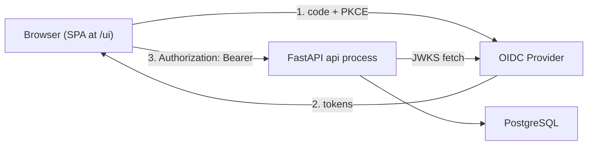
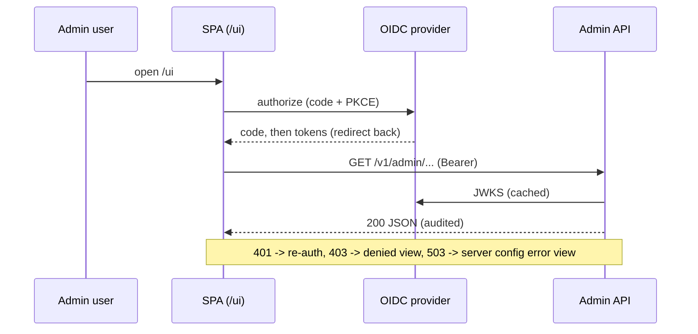
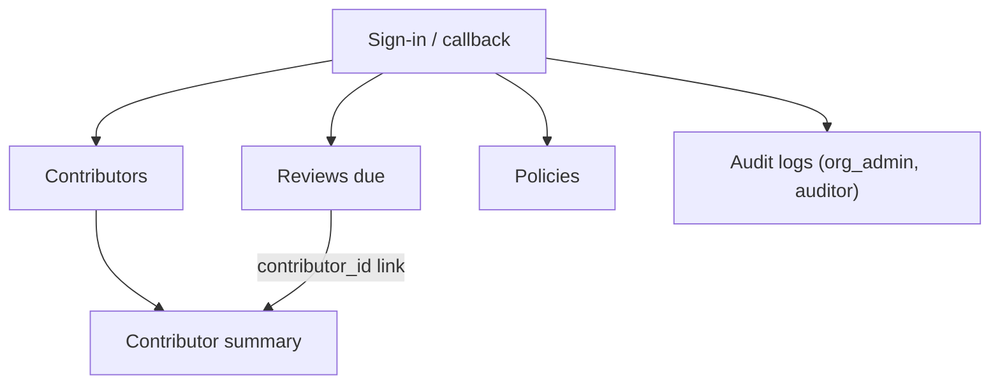

# Admin Frontend Design

Design for the admin UI of the managed coaching server. #51 shipped the
server as a JSON-only API and deferred the UI; this document completes the
design so implementation can start as its own change. Tracking issue: #55.

Status: **design complete, implementation not started.** The server stays
JSON-only until the implementation lands. Every screen below maps to the
admin API that actually shipped (`app/api/admin.py`, `app/schemas/admin.py`);
no new backend surface is assumed except the one runtime-config endpoint
called out in section 6, which is recorded as a follow-up decision, not a
dependency.

## 1. Scope and goals

The frontend serves the four admin roles (org_admin, team_manager, coach,
auditor) who today must curl the JSON API. Contributors and local clients
are out of scope: the collector path is machine-to-machine and has no UI.

Goals, in priority order:

1. Make coaching state visible by inspection: who is active, what categories
   dominate, which reviews are due, what the org policy allows.
2. Make the two privileged writes (policy edits) safe: explicit, role-gated,
   with the privacy implications stated where the toggle is.
3. Add zero trust surface: no new credential store, no server-side session,
   no data the JSON API does not already expose.

Non-goals: contributor-facing views, team dashboards (teams are not modeled
yet), historical trend charts (no time-series endpoint exists), and any
write beyond `PUT /v1/admin/policies`.

## 2. Users and role-based access

Roles come from the verified OIDC token (`app/auth/rbac.py`) and the server
is authoritative; the UI reads the same claims only to shape navigation.

| Capability                  | org_admin | team_manager | coach | auditor |
| --------------------------- | --------- | ------------ | ----- | ------- |
| Contributors list + summary | yes       | yes          | yes   | yes     |
| Reviews due                 | yes       | yes          | yes   | yes     |
| Policies: view              | yes       | yes          | yes   | yes     |
| Policies: edit              | yes       | no           | no    | no      |
| Audit logs                  | yes       | no           | no    | yes     |

Hiding a nav item is a courtesy, not a control: a hand-crafted request to a
role-denied route still gets 403 from the server and still lands in the
audit trail (the audit dependency runs before the role gate).

## 3. Architecture decision

Three options were considered:

| Option | Description | Trade-offs |
| ------ | ----------- | ---------- |
| **A. Static SPA, same origin (recommended)** | Vite-built static bundle served by the existing `api` process at `/ui`; browser does OIDC Authorization Code + PKCE and calls the JSON API with a bearer token. | No CORS, no cookies, no server-side session state (stays Kubernetes-ready); one image, no new Compose service; the API keeps its exact auth model. Cost: a Node build stage in the Dockerfile. |
| B. Server-rendered (Jinja2/htmx) | FastAPI renders HTML; auth via session cookie after an OIDC code flow handled server-side. | Fewer moving parts in the browser, but introduces server-side sessions, CSRF handling, and a cookie auth path parallel to the bearer path the API already has -- two auth models to audit instead of one. |
| C. Separate SPA deployment | Same SPA as A, but its own nginx service and domain. | Independent release cadence, but adds CORS configuration, a second Compose/Ingress entry, and a second thing to health-check -- speculative until release cadences actually diverge. |

**Decision: Option A.** It is the minimum construction that solves the
problem: the API already speaks OIDC bearer and is provider-agnostic; the
browser is just another client of it. Revisit C only if the UI needs to
ship on a different cadence than the server.



## 4. Technology selection

Chosen for the smallest dependency set that keeps the implementation
testable; each line is a decision, alternatives were considered and dropped
as speculative for a five-screen UI.

- **React + TypeScript + Vite.** Boring, dominant, typed against the API
  contract. (Svelte/htmx would also work; React maximizes contributor
  familiarity and testing-library maturity.)
- **TanStack Query** for server state: caching, retries, and invalidation
  after the policy write. No Redux or global client state -- the server is
  the state.
- **react-router** for the five routes.
- **oidc-client-ts** for Authorization Code + PKCE and silent renewal. This
  is the one dependency doing security work, pinned and reviewed like one.
- **Zod schemas mirroring `app/schemas/admin.py`** at the fetch boundary, so
  a contract drift fails a test instead of rendering `undefined`.
- **Plain CSS (CSS modules), no component framework.** Five screens do not
  earn a design-system dependency; tokens (spacing, palette) live in one
  `tokens.css`.
- **Charts as inline SVG** (a bar list for categories, a segmented bar for
  calibration). No chart library: the two visuals are static aggregates.
- **Biome** for lint + format (one tool, mirrors ruff's role server-side),
  **Vitest + Testing Library** for unit tests, **Playwright** for the E2E
  smoke path (section 13).

Versions are pinned by `package-lock.json` / committed lockfile, matching
the declarative-dependency rule the server side follows with `uv.lock`.

## 5. Authentication and session model

- **Flow:** Authorization Code + PKCE, public client, initiated by the SPA.
  No client secret exists in the browser.
- **Token handling:** access token kept in memory only (never
  localStorage/sessionStorage); silent renewal via the provider's refresh
  or iframe mechanism through oidc-client-ts. A hard reload re-runs the
  redirect flow; that is acceptable for an admin tool and cheaper than a
  persisted-token attack surface.
  - Memory-only is **not** the library default and must be configured
    explicitly: oidc-client-ts defaults `userStore` to
    `window.sessionStorage` (verified in `UserManagerSettings.ts`), so the
    implementation must set
    `userStore: new WebStorageStateStore({ store: new InMemoryWebStorage() })`
    and a test must pin that no token ever lands in web storage.
  - The redirect interaction state (`stateStore`: state, nonce, PKCE
    verifier) defaults to `window.localStorage` and has to survive the
    redirect by construction. It contains no tokens and the library clears
    it on callback, so the default is acceptable there -- the boundary is
    "no tokens in web storage", not "no web storage".
- **Claims:** the SPA reads the same claims the server verifies -- the org
  claim for display and the roles claim for navigation shaping
  (`CLAIRVOYANCE_OIDC_ORG_CLAIM` / `CLAIRVOYANCE_OIDC_ROLES_CLAIM`,
  defaults `org` / `roles`); the configured claim names reach the SPA via
  runtime config (section 6), never as hardcoded defaults. Unknown roles
  are ignored, exactly as `parse_roles` does server-side.
- **Logout:** drop in-memory tokens and hit the provider's end-session
  endpoint when it advertises one; otherwise just drop tokens.
- The server keeps rejecting with 401 (bad/expired token), 403 (role), and
  503 (OIDC unconfigured / JWKS unreachable); the UI maps these in
  section 8 rather than retrying its way around them.



## 6. Runtime configuration

The SPA needs five non-secret values: issuer, client id, audience, and the
two claim names it must read (org and roles) -- deployments can rename
those via `CLAIRVOYANCE_OIDC_ORG_CLAIM` / `CLAIRVOYANCE_OIDC_ROLES_CLAIM`,
and a UI that hardcoded the defaults would shape navigation from the wrong
claim in such a deployment. Baking any of this in at build time would make
the image deployment-specific, which the server side deliberately avoids
(config via env, stateless app).

**Design:** the api process serves `GET /ui/config.json` (no auth; values
are public by definition -- they appear in every authorize redirect or are
claim *names*, not values) with `issuer`, `client_id`, `audience`,
`org_claim`, and `roles_claim`, built from one new env var
`CLAIRVOYANCE_OIDC_CLIENT_ID` and the existing
`CLAIRVOYANCE_OIDC_ISSUER` / `CLAIRVOYANCE_OIDC_AUDIENCE` /
`CLAIRVOYANCE_OIDC_ORG_CLAIM` / `CLAIRVOYANCE_OIDC_ROLES_CLAIM`, so the
SPA reads exactly the claims the server verifies. This is the only
backend addition the design requires and ships with the implementation
change, not before. If OIDC is unconfigured the endpoint returns 503, same
contract as the admin routes.

## 7. Information architecture and screens



Shared layout: top bar with organization key (from the org claim), the
signed-in subject, role badges, and sign-out. Left nav lists only the
screens the roles allow (section 2). All timestamps render in the viewer's
local timezone with the UTC value on hover -- the API is timezone-aware
end to end, the UI must not truncate that.

### 7.1 Contributors (`/ui/contributors`)

- **API:** `GET /v1/admin/contributors?limit=&offset=` (default 50,
  max 200; response carries `total`).
- Table: display name (fallback `provider:external_id`), provider,
  external id, email (may be absent -- render empty, do not invent),
  active flag, created date. Row click opens the summary.
- Offset pagination driven by `total`. No search/filter in v1; the gap and
  its trigger are recorded in section 14.

### 7.2 Contributor summary (`/ui/contributors/:id`)

- **API:** `GET /v1/admin/contributors/{id}/summary`; 404 (invalid or
  foreign id) renders "not found", not an error toast.
- Header: contributor identity block, active flag, `last_event_at`.
- **Events by category:** horizontal bar list of `events_by_category`,
  ordered by count desc, using the fixed category vocabulary (avoidance,
  mislabeled-technical, loss-aversion, values-conflict, no-experiment,
  authority-dependence, other). Zero-count categories are omitted, matching
  the aggregate.
- **Quiz block:** attempts, correct (with percentage when attempts > 0),
  and a segmented bar of the calibration distribution (accurate /
  overconfident / underconfident / unknown). When attempts = 0 the block
  says "no quiz attempts", not an empty chart.
- No event-level drill-down: the API exposes aggregates only, and that is a
  privacy feature (`context_summary` never leaves the events table through
  any admin endpoint), not a UI omission.

### 7.3 Reviews due (`/ui/reviews`)

- **API:** `GET /v1/admin/reviews/due?limit=` (due_at ascending -- the
  server orders it as a work queue; the UI preserves that order).
- Table: due date (with "overdue by N days" emphasis), category, signal
  (nullable), interval_days, last_outcome, contributor link
  (`contributor_id` -> summary screen).
- Empty state: "No reviews due" is the success state and looks like one.
- v1 is read-only: there is no "mark reviewed" write -- schedules move when
  the contributor's next quiz attempt is ingested, and the UI says so in
  the empty-action footer.

### 7.4 Policies (`/ui/policies`)

- **API:** `GET /v1/admin/policies`; `PUT /v1/admin/policies` (org_admin
  only -- the form renders read-only for other roles rather than hiding
  values they are allowed to read).
- Three settings, each with its consequence stated inline:
  - `collect_enabled` -- master switch; off means clients get
    "do not collect" from `GET /v1/client/policy`.
  - `allow_context_summary` -- default **off**; the toggle copy states that
    enabling stores abstracted work content from contributors' sessions,
    and that the server confirms storage per event
    (`context_summary_stored`). Turning it **on** requires a typed-confirm
    dialog; turning it off is one click (asymmetric friction, matching the
    default-deny stance).
  - `retention_days` (1..3650, default 365) -- copy states deletion is
    permanent, cascades to quiz attempts, cuts on `occurred_at`, and that
    `CLAIRVOYANCE_RETENTION_DRY_RUN=true` exists for a verification pass
    before tightening.
- The form submits a partial patch (`settings` with only changed fields,
  matching `PolicySettingsPatch`), then invalidates the policy query.
- A tightened `retention_days` shows a warning that enforcement is the
  daily beat task, not immediate.

### 7.5 Audit logs (`/ui/audit`)

- **API:** `GET /v1/admin/audit-logs?limit=&offset=` (org_admin, auditor).
- Table: created_at desc (server order), actor, action (route name),
  target_type/target_id when present.
- The response carries no `total`: paginate forward with "next" enabled
  while a full page returns, disabled on a short page. No count is shown
  rather than a wrong one.
- Viewing this screen writes an audit row itself; the screen says so --
  auditors should see the mirror.

## 8. Error and empty-state contract

One shared fetch layer maps API failures; screens render states, they do
not interpret status codes individually.

| Server response | UI behavior |
| --------------- | ----------- |
| 401 | Drop tokens, silent renew once, else full re-auth redirect. Never a retry loop. |
| 403 | "Your roles do not allow this" view naming the missing capability. No auto-redirect: the attempt is audited and the user should understand why. |
| 404 (contributor) | In-place "not found" state with a link back to the list. |
| 409 / 422 | Form-level error rendering the API detail verbatim (policy form). |
| 503 | "Server configuration error" page: states the server reported OIDC/JWKS unavailability and this needs an operator, not a retry. Fail loudly, mirroring the server's never-fail-open stance. |
| Network failure | Inline retry affordance per screen; TanStack Query backoff capped at 3. |

Empty states are designed, not defaulted: contributors (onboarding hint:
mint a collector token, point a client), reviews due (success state),
audit logs (only possible before first admin access).

## 9. Privacy and security boundaries

- **No third-party calls at runtime.** The SPA talks to its own origin and
  the OIDC provider, nothing else: no CDN scripts, no fonts, no analytics.
  Coaching data is behavioral data about identifiable people; the frontend
  must not widen where it flows.
- **CSP** served with the SPA: `default-src 'self'`, `connect-src 'self'`
  plus the OIDC issuer origin, `frame-ancestors 'none'`. No inline script.
- Tokens in memory only (section 5); no cookies, so no CSRF surface.
- `context_summary` is not exposed by any admin endpoint and therefore
  cannot appear in the UI; the design keeps it that way deliberately.
- Build output is static; the bundle contains no secrets by construction
  (runtime config is fetched, and contains only public OIDC values).
- Dependency count is a security budget: every new package needs a reason
  in the PR that adds it.

## 10. Visual design principles

- Dense, table-first admin layout; prose only where a decision needs
  context (policy consequences).
- The two charts encode one measure each (count) with labeled values --
  anomaly detection by inspection, no legend-hunting. Category colors come
  from one fixed ordinal palette in `tokens.css` so the same category is
  the same color on every screen; the calibration bar uses semantic
  colors (accurate = positive, over/underconfident = warning tones,
  unknown = neutral).
- Light and dark themes via `prefers-color-scheme`; contrast at WCAG AA;
  all interactive elements keyboard-reachable (tables are real tables,
  the nav is a `nav`).
- UI text is English in v1. Strings live in one module so localization is
  a mechanical change later, but no i18n framework ships until a second
  language is actually requested.

## 11. Repository and build layout

```
managed/
  ui/                    # the SPA, an npm project (own lockfile)
    src/
      api/               # fetch layer + zod schemas mirroring app/schemas
      auth/              # oidc-client-ts wiring, role helpers
      screens/           # one directory per screen (7.1..7.5)
      components/        # shared table, bar chart, layout
      tokens.css
    tests/               # vitest unit + testing-library
    e2e/                 # playwright smoke (section 13)
    package.json
  app/ ...               # unchanged
```

Dockerfile becomes multi-stage: a `node` build stage runs `npm ci && npm
run build`, and the existing Python stage copies `ui/dist` to a static
directory the api process mounts at `/ui` (FastAPI `StaticFiles`, SPA
fallback to `index.html` for client-side routes). Worker/scheduler
commands are untouched; the image still runs as the same four commands.

## 12. Deployment

- **Coolify Compose:** no new service. The `api` service gains
  `CLAIRVOYANCE_OIDC_CLIENT_ID`; the existing domain serves `/ui`.
  Health checks are unchanged (static files add no readiness dependency).
- **Kubernetes later:** unchanged mapping from the README; the UI rides
  the api Deployment. If option C (separate deployment) is ever chosen,
  only the Dockerfile split and CORS config change -- the SPA itself is
  origin-agnostic because it fetches runtime config.
- OIDC provider registration is deployment work the implementation PR must
  document concretely: create a public client, redirect URI
  `https://<domain>/ui/callback`, post-logout URI `https://<domain>/ui`,
  no client secret, and verify the handoff by signing in and loading
  `/ui/contributors` before the change is called done.

## 13. Quality gates and verification plan

Deterministic gates first, in CI as a `managed-ui` job mirroring
`managed-server`. The job is path-filtered to `managed/**`, not
`managed/ui/` alone: the smoke exercises serving behavior that lives
outside the SPA tree (`/ui/config.json` and the StaticFiles mount in
`managed/app`, the build/copy path in the Dockerfile), so a server-side
change must not skip it. The Node-only gates (1-3) may additionally be
skipped when the diff touches no `managed/ui/` file, but the smoke (4)
runs for any `managed/**` change:

1. `biome ci` (lint + format), `tsc --noEmit`.
2. `vitest run` -- unit tests including the zod contract schemas parsing
   recorded API fixtures.
3. `npm run build` -- the bundle must build to pass.
4. Playwright smoke against the real service path: the api container with
   SQLite-mode test settings and a stub OIDC issuer (the test suite
   already fabricates signed JWTs in `tests/test_oidc.py`; the E2E harness
   reuses that key material). The smoke signs in, loads each of the five
   screens, edits a policy as org_admin, and asserts the 403 view as
   coach. This is the live proof the completion gate requires -- type
   checks and unit tests verify shape, the smoke verifies behavior.

Definition of done for the implementation issue: all four gates green in
CI, plus the deployment verification in section 12 recorded in the PR.

## 14. API gaps observed (follow-ups, none blocking v1)

Recorded here per the design rule that gaps surface as decisions, not
silent backend patches:

1. **Runtime UI config** (section 6): `GET /ui/config.json` +
   `CLAIRVOYANCE_OIDC_CLIENT_ID`. Ships with the implementation.
2. **Contributor search/filter:** `GET /v1/admin/contributors` has no
   query filter; fine below a few hundred contributors, needed beyond.
   Trigger: first org where paging hurts.
3. **Reviews-due pagination and per-contributor filter:** the endpoint has
   `limit` only and no `contributor_id` filter, so the summary screen
   cannot show "this contributor's due reviews" without over-fetching.
   Add `offset`/`contributor_id` when the queue outgrows one page.
4. **Audit-log total and time filter:** offset paging without `total` is
   deliberate v1; an auditor asking "what happened last Tuesday" will need
   `from`/`to` parameters eventually.

## 15. Deferred

- Teams views: blocked on the teams data model (deferred in #51).
- Trend-over-time charts: needs a time-bucketed endpoint; do not fake it
  client-side from aggregates.
- Contributor-facing or self-service views: different audience, different
  trust model, separate design.
- Localization beyond the string-module preparation (section 10).

## 16. Decision summary

| # | Decision | Recommendation | Alternatives kept on record |
| - | -------- | -------------- | --------------------------- |
| 1 | Rendering model | Static SPA, same origin at `/ui` | Server-rendered htmx; separate deployment |
| 2 | Framework | React + TS + Vite | Svelte, htmx |
| 3 | Auth | OIDC code + PKCE, tokens in memory | Cookie session (rejected: second auth model) |
| 4 | Runtime config | `GET /ui/config.json` from env | Build-time baking (rejected: per-deploy images) |
| 5 | Styling | CSS modules + tokens, no framework | Tailwind/MUI (speculative at 5 screens) |
| 6 | Charts | Inline SVG | Chart library (speculative for 2 static visuals) |
| 7 | Serving | StaticFiles in api image, multi-stage build | nginx sidecar |
| 8 | Quality gates | biome/tsc/vitest/build + Playwright live smoke | (none) |
