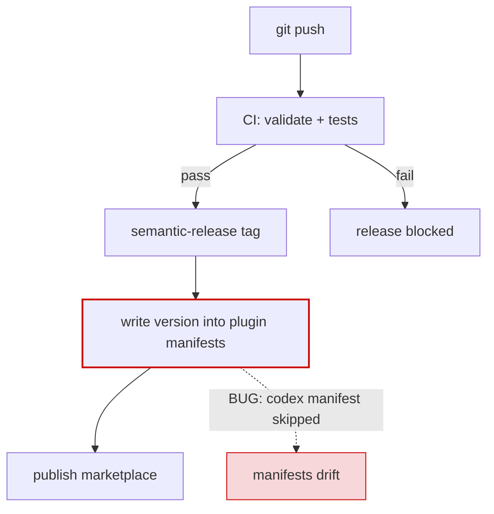

# Worked example

The person, reviewing a `review-verdict` handoff about a release-pipeline fix,
asks: "Can you show me the failure path as a diagram?"

The request is explicit, so `visual-handoff` augments the routed skill. The
information structure is a flow with one branch that misbehaves — a
`flowchart` per the notation guide.

## Diagram

## Reading

The red dashed edge is the defect: the version write updates one manifest but
skips the Codex one, so the two manifests drift. Everything upstream of
`manifests` is healthy.

## What the skill did *not* do

- It did not replace the handoff's **Verdict**, **Evidence**, **Risks**, or
  **Next Move** — the diagram sits beside them as added evidence.
- It did not conclude the person "is a visual learner" or record a style
  preference for later sessions.
- It did not attach a rendered image without source — the fenced Mermaid block
  is the diagram of record.
